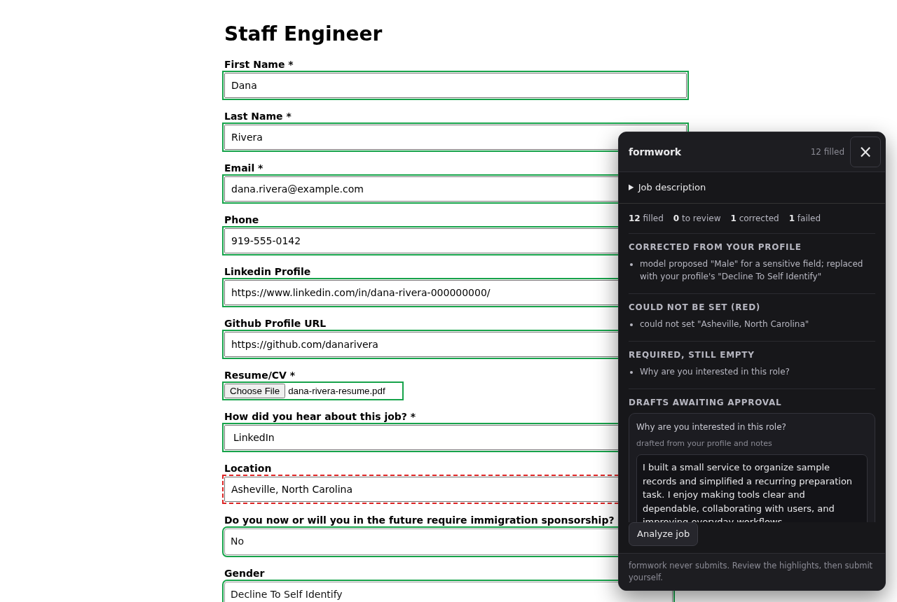

# formwork

Fill job applications from your own profile — locally, with every answer reviewable before you submit.



Job-application autofill exists, but the good ones are SaaS: you hand a company your full work history, contact details and résumé, and pay a subscription to have it typed back into forms. formwork does the same job from your own machine, against your own model, and shows you exactly what it did.

---

## What it does

- **Fills application fields across multiple tracking systems**, using their labels, roles and available options. Compatibility varies by control and application flow; review the result before continuing.
- **Answers factual questions with no model at all** — name, contact details, address, work authorisation, EEO answers, education, start date. These come straight from your profile.
- **Drafts the open-ended ones** from notes you write, into a staging area you approve before anything is typed.
- **Reuses your approved answers** on later forms, matched by intent rather than wording.
- **Attaches your résumé and cover letter** to upload fields.
- **Flags a letter that reads like AI wrote it**, and redrafts it on one click.
- **Creates accounts** on systems that make you register before applying, from credentials the model is never shown.
- **Opens forms that are collapsed** behind an Apply button, and fills forms embedded in an iframe on a company's own careers site.
- **Handles the widgets that break naive autofill**: portalled menus, virtualised option lists thousands long, dropdowns built as buttons, two-level category pickers, segmented date fields, and autocompletes that discard anything not chosen from their own suggestions.
- **Refuses bot traps** — the hidden fields applicant tracking systems plant to catch robots.
- **Reports what it could not answer**, rather than guessing. A field is either right or visibly blank.
- **Nothing submits automatically.** You review each application and choose whether to submit it.

Alongside the extension: a **dashboard** that queues postings, prepares an application and puts it on one screen to confirm; a **résumé parser** that builds your profile from LaTeX; a **job aggregator** that assembles the queue; and browser harnesses for checking application flows.

The dashboard also includes a list or board pipeline, source and monthly reports,
interview reminders, application handoff downloads, and a locally prepared weekly
digest. Compare saved résumés against a posting and export eight résumé styles to
PDF or Word. Public Rippling and SmartRecruiters boards are configurable in Settings.
In the extension, **Analyze job** shows skill evidence and lets you switch résumés
before explicitly saving a posting.

---

## What makes it different

**Semantic field matching.** formwork reads labels, `aria-*` attributes and option lists, then asks a model to map fields onto your profile. The general filler avoids maintaining a separate map of field names for each employer. Unusual widgets still need compatibility fixes, and the dashboard uses ATS-specific navigation where needed.

**The model is not trusted.** It proposes; a validation layer decides. Two classes of field are *pinned* to your profile and the model's answer is discarded even when it agrees:

- **Contact identity** — name, email, phone and links. These answers come directly from the profile. Known contact values and street address are removed from model prompts; town, state, work history and writing notes may still be included as drafting context. Review free-text notes before using an external provider.
- **Demographics, work authorisation, criminal history, salary.** A plausible-looking wrong answer to *"are you Hispanic or Latino?"* is far worse than a blank field.

The validator enforces these pinned values in code. A model proposal cannot override the profile for these fields.

**Embedded forms work.** Some companies host the posting on their own domain and embed the ATS form in an iframe. formwork runs in every frame: the panel stays in the top window, the filling happens in the frame that actually holds the form. Filling only the top document would miss the majority of live postings.

**Nothing is submitted automatically.** The extension fills and highlights. The optional dashboard has a separate Submit application action that requires your click.

---

## Install

No store listing yet — load it unpacked:

1. Clone this repo.
2. Open `chrome://extensions`, enable **Developer mode**.
3. **Load unpacked** → select the `extension/` directory.
4. Open formwork's **Options** and add a profile (below).

## Setup

**On first install, formwork opens a guided setup** — eleven short steps covering who you
are, where you live, work eligibility, voluntary disclosures, your résumé, account
credentials and a drafting model. Every step is skippable, and a partial profile still
fills the fields it covers. Re-run it any time from Settings → *Run guided setup…*.

The **dashboard** opens Settings when no profile exists. Its forms cover contact
details, address, links, work history, education, projects, skills, authorization
and application preferences. Each section saves separately and reports whether
the extension received it. Optional answers start unanswered; existing custom
fields survive edits. Résumé import and the section editor are linked from this
page. JSON remains available under Advanced, but is not required for these fields.

In dashboard Settings, save and test the drafting model, then select **Connect
extension**. Formwork tests the model from inside the extension before saving
the connection. If Chrome needs host permission, open the dashboard's Browser
tab and click **Allow access and connect** on the dedicated page. **Test extension
connection** checks it again without changing settings. Provider keys remain on
the dashboard server. Docker startup preserves a saved provider; environment
defaults only initialize a browser that has no provider yet.

For a browser on another machine, expand **Advanced: dashboard connection
address** and enter the directly reachable dashboard URL. The initial address
can also be set with `FORMWORK_EXTENSION_DASHBOARD_URL`; by default it is the
dashboard's loopback address and `FORMWORK_PORT` (9113 if unset).

**Settings → Your job search** saves target roles, preferred locations and
skills, excluded companies/title phrases, and newest/recommended ordering.
Without target roles, saved career titles guide ordering. Explicit target roles
replace the older title regex, so a career change is not filtered out before
ranking. **Choose public job sources** lets you edit Greenhouse, Lever and Ashby
board IDs, paste Workday careers board URLs, and select the Remotive or Arbeitnow feeds. Community trackers can be configured in `tools/job-sources.json`. Save, then refresh
jobs. The dashboard ranks all collected matches before applying the queue limit;
**Why this job is here** explains the ordering and missing information.
Workday board URLs can be configured in Settings; saved source selections are
preserved. Its public feed is paginated and cached for six hours (failed/partial
collections retry after five minutes). Each board has a two-minute/5,000-posting
collection ceiling; incomplete results are reported in source health. Workday
list results omit descriptions and exact dates, so those remain unknown until
you open the posting. Discovery does not bypass Workday account requirements.

For Workday applications, Prepare opens the application and pauses at sign-in.
Sign in through **Browser**, then choose **Resume after sign-in**. Each filled
page stays available for review; approve its drafts, then press **Save and
continue**. The dashboard keeps prior-page answers and lends the same prepared
résumé and approved cover letter to later pages. Validation errors leave the
current page open. **Submit application** appears only at Workday's final review.
If you change pages manually, re-read the page and use **Fill this step** to resume.
The desktop retries rejected dropdown, choice and date inputs using real browser
events and verifies the exact value. It leaves ambiguous options and incomplete
dates for review. Authenticated tenant-specific flows still need live verification; account setup,
verification codes and employer-specific unsupported controls can require you.
**Seniority and work location** adds career levels, countries and remote/hybrid/
onsite preferences. Explicit mismatches can be hidden; uncertain locations stay
visible for review. Saved career levels can supply a soft ranking signal.
Remote does not automatically mean worldwide, and country checks do not establish
work authorization or sponsorship. This is preference and profile evidence,
not an ATS score or a guarantee of eligibility.

**Settings → Gmail connection** connects job-search mail through your own Google
OAuth client. The Job search inbox offers reviewed application updates and
provenance-backed sender imports; optional background synchronization is available.
Follow [Gmail setup](docs/google-connection.md) for callback registration and
consent. Calendar synchronization is not part of this connector yet.

Everything below is the manual route, and is worth reading if you keep your résumé in
LaTeX — the parser fills in far more than the wizard asks for.

### 1. Profile

Your profile is structured JSON. If you keep your résumé in LaTeX, generate it:

```bash
python3 tools/parse_resume.py resume.tex -o profile.json
```

Every application also asks things no résumé contains — work authorisation, EEO questions, earliest start date. Put those in an `answers.json` beside the résumé and they are merged in, so re-parsing never clobbers them:

```jsonc
{
  "work_authorization": { "authorized_to_work_us": true, "requires_sponsorship_now": false },
  "demographics": { "gender": "Decline To Self Identify" },
  "preferences": { "earliest_start_date": "Immediately" }
}
```

Anything still unanswered is listed in `_needs_input`, and formwork will leave those fields blank rather than guess. Paste the resulting JSON into Options.

Not a LaTeX user? Use the dashboard forms or reviewed résumé import. For custom
profiles, `tests/fixtures/profile.example.json` is a complete schema example.

### 2. About you (optional, but this is the quality lever)

Free-text notes — what you care about, hobbies, why you got into this. Used only when drafting open-ended answers. Drafts written from a résumé alone read like a résumé; drafts written from real notes read like you.

### 3. Account credentials (optional)

Some systems (Workday, iCIMS, SmartRecruiters) make you register before you can apply. Put an email and password in Options and formwork fills those signup and login forms too.

A password is answered **only** from these stored values. The model is never shown them, and a password it proposes anyway is discarded and reported rather than used. They are stored unencrypted in extension storage, so use a password unique to job applications.

### 4. Model

| Provider | Use when |
|---|---|
| **Ollama** | Local and free. Uses the native `/api/chat`. |
| **Homelab API** | You already run a server-side proxy (see `server/jobfill.py`). |
| **OpenAI-compatible** | OpenAI, OpenRouter, LM Studio — anything speaking `/chat/completions`. |
| **Anthropic** | Claude, called directly from the browser. |

> **Ollama users:** point the *Ollama* provider at it, not the OpenAI-compatible one. Ollama's `/v1` shim cannot disable reasoning and returns it in a separate field, leaving `content` empty. Measured on the same form: **3 fields in 73s** through `/v1` versus **16 in 6.2s** natively.

> Ollama also rejects `chrome-extension://` origins with a 403. Either start it with `OLLAMA_ORIGINS='chrome-extension://*'`, or route through a server-side proxy like `server/jobfill.py`, where CORS does not apply.

Saving Options asks Chrome for permission to reach your model's host. Decline it and formwork still fills every profile-derived field — it just can't ask the model anything.

---

## How it works

```
  scrape            plan (background worker)              fill
┌──────────┐   ┌────────────────────────────────┐   ┌──────────────┐
│ DOM       │──▶│ prompt (identity redacted)     │──▶│ React-safe   │
│ semantics │   │   ↓                            │   │ writes       │
│ + options │   │ model  →  proposed values      │   │   ↓          │
└──────────┘   │   ↓                            │   │ verify each  │
               │ VALIDATE ── pin sensitive       │   │ field re-read│
               │            snap to profile      │   │   ↓          │
               │            match option lists   │   │ highlight    │
               │   ↓                            │   └──────────────┘
               │ draft essays → staging area     │
               └────────────────────────────────┘
                          nothing auto-submits
```

### The widgets

Writing into plain inputs is not the hard part. Each of these cost real debugging, and each has a fixture so it cannot regress:

- **Comboboxes commit by keyboard, not clicks.** react-select (Greenhouse, Ashby) portals its menu and ignores synthetic clicks on options — the click "succeeds" while nothing is selected. formwork types to filter and commits with `Enter`.
- **A menu belongs to the field that opened it.** Multiselects mark their chosen-pills area `role="listbox"` too, and popups render at the end of `<body>`. Taking "the first open listbox" made two fields report a third one's options — worse than finding none, because the value chosen comes from another question's list.
- **Long lists are virtualised.** About thirteen of 250 countries exist in the DOM at a time, always from the top, and typing does not filter them. The menu is scrolled until the match appears.
- **Some entries are categories.** Clicking "Website" opens a submenu rather than answering; the drill-down follows it, and says so when it has to pick from a list your profile cannot name.
- **A date is one question across three inputs.** Month, day and year sit behind a visible stand-in, each a fraction of a pixel wide. They are written whole or not at all — a half-written date leaves the widget holding `08//`, an error it keeps showing even after correction.
- **Autocompletes want keystrokes.** A place lookup that is handed a value in one go discards it, and one that is focused first blanks itself. Typed character by character without focusing, it resolves.
- **The filler trusts the DOM, not the write.** Every field is re-read after writing, and again once the page settles, because widgets revert asynchronously. `filled` means *confirmed present on the page*; anything that didn't stick gets a red ring instead of a silent success.

### Bot traps

Applicant tracking systems plant fields a person cannot see but a naive autofiller completes, and treat anything typed into one as proof of a robot. Workday's is named `website` and labelled *"This input is for robots only"*, rendered a fraction of a pixel tall with a zero clip-path while reporting itself as perfectly visible.

Filling one risks your account on a site you need, so wording, naming or impossible geometry is each enough to skip a field. The same rule cannot condemn a real question: applicant tracking systems routinely shrink a genuine radio to a pixel and draw their own control over it, so geometry alone never disqualifies a checkbox or radio.

### Free-text answers

Open **Job description** in the extension panel to check the employer, role and
posting text used for drafting. Use **Use description on this page**, or paste the
original posting and select **Save job context**. Descriptions follow matching
posting URLs into their application pages; different job IDs stay separate.
Filling and revising both use the displayed context. If the posting is missing,
Formwork says so instead of assuming the role's requirements.


Essays are drafted separately and land in a **staging area**. A draft cannot reach the page without an explicit approval — that invariant lives in the data (`needsApproval`), not in a prompt. Auto-approve exists and is off by default.

Approved answers go into an **answer bank**, matched on later forms by wording *and* by intent — "Why do you want to work at X?" and "Why are you interested in this role?" share no significant words but are the same question. Portable answers can be reused when no job description calls for a fresh draft. Role-fit questions are drafted for the current posting; employer-specific references are restricted to the matching employer, and role-fit references also require the same role.

---

## Privacy

- The standalone extension stores data in `chrome.storage.local`. The optional dashboard stores profiles, application history, generated documents and provider settings on your server. There is no Formwork account or telemetry.
- Model prompts remove known profile contact values (name, email, phone, links and street address). Town, state, work history and writing notes supply drafting context. Review free-text notes before using an external provider: redaction cannot identify every private fact in arbitrary prose. Contact fields are filled from your profile.
- Documents are stored as data URLs in your browser and attached directly to upload fields.
- The only outbound requests are to the model provider *you* configured.

---

## Supported

Content scripts run automatically on Greenhouse, Lever, Workday, Ashby, BambooHR, Workable, Jobvite, SmartRecruiters and iCIMS — including forms those systems embed as iframes into a company's own careers site.

On any **other** site, click the formwork toolbar icon and the panel is injected on demand (`activeTab`), so no permission over every site you visit is required up front. Because the approach is generic rather than per-ATS, it usually works there too.

Compatibility varies by application page and account state; the regression suite uses recorded schemas and controlled browser fixtures.

**Known limitations:**

- **A content script cannot produce a trusted event.** A few widgets respond only to genuine input — Workday's "How did you hear about us" and its date segments ignore synthetic clicks *and* synthetic keystrokes. formwork reports those as unset and says why; it never claims to have filled one. The Workday harness drives a real browser and can complete them.
- **Workday's own screens are turned by the harness, not the extension.** The extension fills whatever page it is on; `tools/workday.mjs` walks the six-screen flow.
- **Listing pages aren't application pages.** Some `?gh_jid=` links land on a search view with no form anywhere. Nothing to fill.
- **Workable history editors support multiple entries.** Autofill adds saved education and employment records, including internships, through each entry’s Update control. Matching entries are skipped on rerun, and unfinished edits are preserved. Other ATS history editors still need manual entry management; repeated records with the same school/degree or employer/title need review.
- **Checkbox groups support multiple answers.** Every requested option must match before the selection changes. Set language proficiency in Settings → Languages. C2 questions use these explicit records; preferred interface language is not proficiency evidence. Searchable multi-select dropdowns still need separate verification.
- **Cover-letter generation is intentionally minimal** — the drafter refuses to make claims about a company it knows nothing about.

---

## Finding jobs to fill

formwork fills the form in front of you; `tools/find-jobs.mjs` builds the list of
forms worth opening.

```bash
node tools/find-jobs.mjs --query "software engineer|backend" --since 14
node tools/find-jobs.mjs --boards example-company --remote --out queue.json
```

| Flag | Effect |
|---|---|
| `--query <regex>` | Match the job title |
| `--location <regex>` | Match any listed location |
| `--remote` | Only postings listing remote or anywhere |
| `--needs-sponsorship` | Hide roles that state they won't sponsor or require citizenship |
| `--since <days>` | Drop anything posted longer ago than this |
| `--limit <n>` | How many to print and write (default 40) |
| `--out <file>` | Write the matches as JSON |
| `--no-github`, `--no-boards` | Use only one source family |

It aggregates **public, structured** job sources: optional community trackers on
GitHub, employer board APIs, and public job feeds. Board and community sources
are configurable in `tools/job-sources.json`; the repository ships no employer
board targets.

It deliberately does **not** touch LinkedIn, Indeed or Simplify. All three are
login-walled, prohibit automated access in their terms, and offer no public jobs
API — scraping them would risk the account you job-hunt with, for postings these
sources already carry. A test asserts none of those hosts ever becomes a source.

Nothing is applied to automatically. The tool produces URLs; you open them.

---

## The dashboard

The extension fills the form in front of you. The dashboard is the other half:
a queue to work through, one screen to confirm an application on, a record of
what was actually sent, and the per-posting documents the extension cannot
produce.

```bash
python3 -m venv .venv && .venv/bin/pip install -r server/requirements.txt
.venv/bin/uvicorn dashboard.app:app --app-dir server --host 127.0.0.1 --port 9113
```

It needs a browser with the extension loaded and its DevTools port open — the
same browser you would drive by hand:

```bash
chrome --load-extension=extension --remote-debugging-port=9223 \
       --user-data-dir=~/.formwork-chrome
```

| Variable | What it points at |
|---|---|
| `FORMWORK_CDP_URL` | that browser's debugging port (default `http://localhost:9223`) |
| `FORMWORK_MODEL_URL` | the provider proxy (default `http://localhost:9105/api/jobfill/complete`) |
| `FORMWORK_NOVNC_URL` | a noVNC view of the browser, if it runs headless somewhere else; `off` hides the tab |
| `FORMWORK_PROFILE_DIR` | where your profile, résumé and notes live |
| `FORMWORK_STATE_DIR` | database and generated documents (default `~/.formwork`) |

### As one container

```bash
docker compose -f docker/compose.yaml up -d   # then http://localhost:9113
```

The image holds the browser, a view of it, the dashboard and a LaTeX engine,
because those four have to agree with each other: the dashboard talks to the
browser over its debugging port on localhost and hands it documents off a
shared disk. Splitting them would mean publishing that debugging port on a
network, which is a remote-code-execution hole with a nice name — so it is
bound inside the container and is not among the ports exposed.

Two directories come from outside. `/profile` holds `profile.json`, `about.md`,
an optional `credentials.json` and a résumé PDF; it is read on every start and
written into the extension, so the profile lives in one place on disk rather
than being pasted into a textarea again whenever a browser profile is rebuilt.
An empty directory is a valid first run — the setup wizard is still there.
`/state` holds the database, the documents it generates, and the browser's own
profile, so a login to an applicant tracking system survives a restart.

| Variable | |
|---|---|
| `FORMWORK_MODEL_URL` | a model this container can reach; the compose file assumes one on the host |
| `FORMWORK_ALLOW_ALL_HOSTS` | see below — off by default |
| `FORMWORK_NOVNC_URL` | only if the view is somewhere other than this container's 9112 |

**On `FORMWORK_ALLOW_ALL_HOSTS`.** The extension ships `activeTab` rather than
access to every site, so on a normal browser it can read a page only when its
icon is clicked, and it runs by itself only on the applicant tracking systems
its manifest names. A dashboard has no icon to click. Filling a posting on a
company's *own* careers domain therefore needs that host granted, and granting
them one at a time needs the very click that is missing — so the switch is all
or nothing. It is off by default, and the container says out loud in its log
when it is on. Leave it off and the nine listed systems still work, which is
most postings.

Two things the container does that a browser you drive yourself does not need,
both because there is nobody there to click:

- **It grants the model's origin itself.** An extension's optional host
  permissions are granted through a native dialog, so the container writes the
  grant into the browser profile's own permission record instead. Chrome keeps
  that file in memory and rewrites it on exit, so the browser is stopped first
  and restarted after — which is the few seconds of "restarting the browser
  once" in the startup log.
- **It seeds the profile on every start**, from `/profile`.

Each tab has an address: `#queue`, `#review`, `#applications`, `#workspace`, `#documents`,
`#browser`, `#settings`. Opening the root lands on whatever is waiting — the
review screen if an application is ready, the queue if not — so that is the one
worth bookmarking.

### Confirming an application

**Prepare** on a queued job reads the posting, writes its documents, fills the
form, and puts the result on one screen: what was filled, what is flagged, what
was drafted, and which résumé is attached. Anything uncertain is at the top and
editable in place — a correction is written back through the extension's own
filler, so a dropdown gets the keyboard dance it needs rather than a value typed
at it.

**Auto mode** approves drafted free-text answers without asking and marks the
application ready. It does not submit. There is no setting that makes it
submit — submission is one button, in front of a person, and the button names
the control it is about to click. Applicant tracking system terms generally
prohibit automated submission, and the account at risk is the one you are
job-hunting with.

Submission lives in `server/dashboard/drive.mjs` and nowhere in `extension/`.
The extension identifies submit controls in order to *refuse* them, and that
stays true: a content script that can submit is one bug away from submitting on
its own.

### Tailored résumés

With **Tailor the résumé per posting** on, the master `resume.tex` is edited —
never regenerated — into a version for that job, compiled, and attached in place
of the generic one. Editing spans in the original file rather than rebuilding
from a parsed model is what keeps a résumé's preamble, spacing and macros
exactly as they were; an empty plan gives the master back byte for byte, and
there is a test that says so.

The per-posting PDF is handed to the *extension* before it fills, in the storage
slot the user's own résumé lives in, and the extension attaches it the way it
already knows how. Setting the file input afterwards does not work: a form that
has taken a file replaces the input with a filename and a remove button, so by
the time there is something to override there is no input left to override it
on. Greenhouse does exactly this, and the tailored PDF was silently never used.
The borrowed slot is restored afterwards even if the fill fails — it is the
user's setting, not the dashboard's.

The model may reorder entries and drop ones the posting has no use for. What it
may do *inside* an entry is deliberately narrow, and both rules are enforced
rather than requested:

- **It may not add a fact.** A number, percentage or technology absent from the
  master is a fabrication. Rejected; the original bullet is kept.
- **It may not lose a measured one.** A regression suite guards against a rewrite
  replacing specific evidence with vague adjectives. A résumé's concrete
  results need to survive the edit.

At most one bullet per entry may be dropped, and never the last one. Choosing
which project belongs on the page is a judgement you can check at a glance, and
it shows in the diff; choosing which of four bullets under a job to delete is
the same judgement made invisibly, four times.

Every rejection is reported on the review screen with what was proposed and why
it was refused, next to a plain-language summary of what the tailoring did. A
cover letter is drafted the same way and checked against the same claim rules,
into the same approval gate.

### Writing review with Humanizer

Cover letters, application answers and career drafts use the
[Humanizer](https://github.com/blader/humanizer) v3.0.0 style checklist.
These checks flag wording to review; they do not determine who wrote it or
predict an employer's response.

The Python detector generates a shared rule catalog for the dashboard and
extension. Initial drafts, revisions, reused answers and manual edits get style
feedback. Semantic rules also guide drafting; regexes cannot establish whether
an attribution or claim of significance is justified. Revisions retain the
existing approval gate and checks for unsupported or lost claims. Cover letters
also receive a model-assisted factual review that distinguishes your experience
from duties in the posting. Its findings are advisory; a clean review is not
proof. Editing the letter marks an older review stale.

Patterns a regex cannot judge are left out, and a pattern a person might choose
on purpose — one dash, one stock word — is reported only when the letter shows
another tell as well. A chip that is always lit is a chip nobody reads.

Approving a cover letter compiles the exact approved text and checks whether
the file was attached. If the site's upload control is gone or rejects the
file, the dashboard shows a download and an explicit manual-upload confirmation.
Editing a previously approved letter requires approval again before submission.
The upstream MIT notice is in `licenses/humanizer-MIT.txt`.

### Build and arrange a résumé

The **Résumé** tab includes a section editor. Start from the saved profile or
build a document directly; edit headings, entries, dates, locations and bullets,
and move sections or entries up and down. Choose classic or compact layout,
Letter or A4 paper, font size and margins. The on-screen preview updates as you
edit; preview the exported PDF to check exact spacing and page breaks.

Saving creates an immutable version that can be reopened as a new draft or
selected for an application. PDF and Word exports share the same content and
section order. Generated LaTeX retains the entry structure used by constrained
per-posting tailoring. Editing a document does not overwrite the autofill
profile or the documents recorded for an already submitted application.

### Job-search workspace

**Job search** adds a pipeline from queued through accepted or rejected, notes
and status history, interview rounds and outcomes, follow-up reminders,
contacts and referral interactions, saved filters, CSV and calendar exports.
Select jobs to compare their evidenced skills or prepare them sequentially;
each prepared application still needs individual review and submission.

Discovery includes public Remotive and Arbeitnow feeds alongside the existing
community lists and company boards. The queue displays source health and links
back to each posting. Save keyword alerts in Queue and optionally set a refresh
interval in Settings (off by default). Notifications stay in the dashboard.
Skill coverage shows recognized requirements with evidence and gaps; unknown
descriptions remain unknown. It is not an ATS score. The on-demand detailed fit
analysis validates source quotes before presenting model-proposed evidence.

**Résumé** imports PDF, DOCX, text and LaTeX into an editable review step. Save
named versions, choose one per application, and export PDF or DOCX. Scanned PDFs
need OCR first. **Use this resume to update autofill** extracts work history,
education, projects and skills through your saved model. Each suggestion shows
its source; unsupported text is removed. Review the proposed fields and select
the sections to replace. Contact details and sensitive answers are preserved.
Career content must start with a recognizable section heading; the preceding
contact header is excluded from the model request. LaTeX versions retain the constrained per-posting tailoring;
plain-text versions use a simple document layout. Career tools prepare
follow-ups, outreach, interview questions, practice-answer feedback and advice,
with draft history. Offer comparisons use compensation figures you enter.

**Settings** edits the profile and synchronizes it to the extension, reporting
browser failures with a retry option. Dashboard drafting supports Homelab,
native Ollama, OpenAI-compatible and Anthropic endpoints, with a connection
test. Keys are saved in a mode-600 `provider.json` under `FORMWORK_STATE_DIR`;
the UI receives only whether a key exists. To use this same provider from the
extension, select its Homelab provider and the dashboard base URL.

Optional middle/preferred names and birth date can be entered in Settings.
Unknown values remain unanswered; a preferred name never defaults to a legal name.

Feature coverage alone does not establish better application or hiring outcomes.
Compatibility depends on each employer’s page, account state and form controls.

## Checking application flows

Browser harnesses use controlled pages and can also inspect a posting with an explicitly supplied URL. The Workday walkthrough stops before its final review action.

```bash
node tools/sweep.mjs --from queue.json     # read-only: what would be understood
node tools/workday.mjs <posting-url>       # fills a Workday application, stops at Review
```

`sweep.mjs` loads each posting, runs the scraper and validator over it, and
reports fields found, fields answerable from the profile alone, and any label
that is an internal id, a placeholder or an instruction rather than a question.
It types nothing. It exists because the scraper's rules are about how real
applicant tracking systems build forms, and a change that helps one and quietly
breaks another looks identical from inside the fixture suite.

`workday.mjs` is the exception to "one page at a time": Workday gates the form
behind an account and splits it across six screens. It reuses the extension's
own scrape / validate / fill modules and supplies only what the extension
cannot — getting past the gate, and turning the page. It identifies submission
controls and refuses to click them, and a test enforces that rather than
trusting care.

Where the two disagree, believe the extension. The harness drives a real
browser and can produce trusted events; a content script cannot, so a widget
that only responds to genuine input (Workday's "How did you hear about us", its
date segments) is filled by the harness and honestly reported as unset by the
extension.

---

## Development

```bash
npm install                  # playwright, for the e2e suite only
npx playwright install chromium
python3 -m venv .venv
.venv/bin/pip install -r server/requirements.txt

npm run test:fast            # unit + integration + parser, offline, ~1s
npm test                     # everything, including real-Chromium e2e
npm run bench -- --provider ollama --base http://localhost:11434
```

| Suite | Covers |
|---|---|
| `tests/unit/` | Pinning, PII redaction, answer-bank matching, provider wire shapes, approval gate, job aggregation |
| `tests/integration/` | The full planning path against a schema captured from a live Greenhouse posting |
| `tests/e2e/` | The real extension in Chromium: first-run setup, fills a served form, attaches a résumé, approves a draft, refuses bot traps |
| `tests/test_parse_resume.py` | LaTeX → profile, including `\entry` slot ordering and detex |
| `tests/test_dashboard.py` | Editing a résumé losslessly, and the rules a rewritten bullet must satisfy |

The e2e suite serves both the fixture form and a stub provider, so it is deterministic and needs no network or model.

If you use [`verify`](https://github.com/JeremiahM37/verify), `.verify.yaml` runs the test suites and checks the configured deployment endpoints.

---

## Server-side proxy (optional)

`server/jobfill.py` is a FastAPI router for the "Homelab API" provider. It moves messages to Ollama and text back — deliberately dumb, so the prompt has exactly one definition (in the extension) and the self-hosted and BYOK paths cannot drift apart. It also sidesteps browser CORS entirely.

---

## Licence

MIT — see [LICENSE](LICENSE).

The AI-writing patterns in `server/dashboard/humanize.py` are adapted from the
[humanizer](https://github.com/blader/humanizer) skill, MIT © 2025 Siqi Chen.

The standalone extension never submits. The optional dashboard has a separate Submit application action that requires a person to click; it checks résumé evidence, records the attempt and blocks retries when the result is uncertain. Check each employer’s policies before using that workflow.


In Settings → Contact details, **Phone country** supplies separate dialing-country
selectors; it can differ from your residence. Use an international phone number
starting with `+` whenever possible. Settings → Application preferences includes
**Preferred work locations**, one city per line, for office-location checklists.
Blank proficiency and location preferences remain unknown rather than being inferred.

**Preferred contact method** is an optional saved application preference in
guided setup and dashboard Settings. Enter the method you want employers to use
(for example, Email or Mobile Phone). Blank stays unknown; Formwork does not infer
it from your saved phone type. Some forms enable State/Province only after Country
is selected; another Fill this form run reads those newly enabled fields.

### Résumé checks and submission receipts

Opening a prepared application checks its current résumé selection again. Use
**Attach / replace résumé** if the employer restored an older file, then inspect
**Read the employer’s review**. Formwork verifies local upload bytes by SHA-256;
a server preview may provide only a filename. Missing or conflicting evidence
blocks submission.

A click is not a receipt. The dashboard records the attempt and exact document
copies before sending, and marks it submitted only after explicit page
confirmation. If the outcome is uncertain, **Check confirmation** reads the page
without sending again. Retry stays blocked until the outcome is reconciled.
